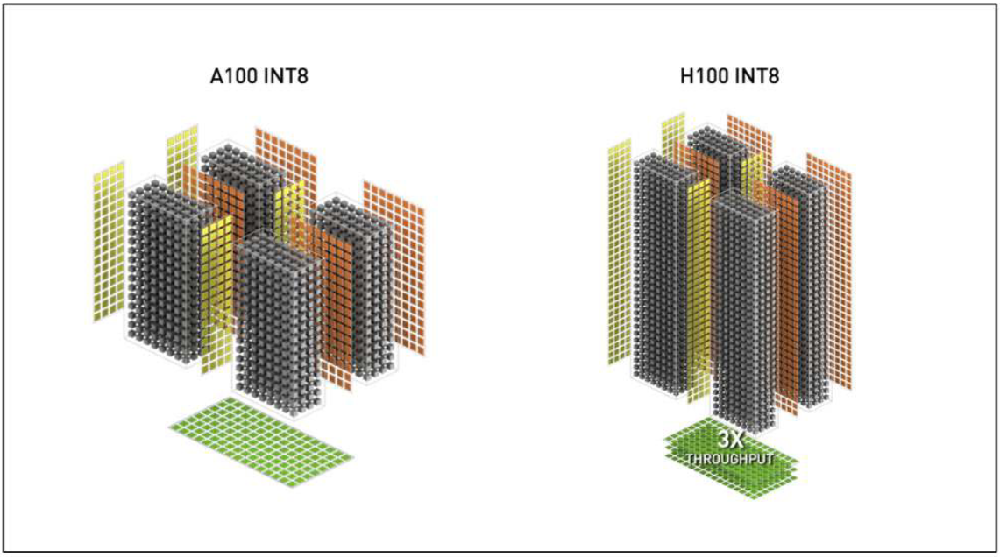
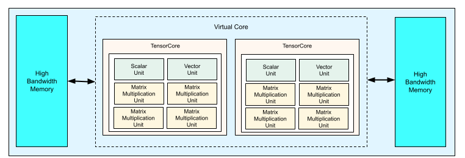

## 1. NVIDIA Hopper 아키텍처 (H100 SXM5 기준)

*   **H100 Full GPU with 144 SMs**
  

*   **GH100 Streaming Multiprocessor (SM)**
  

*   **단일 Tensor Core 연산 규격 (M, N, K):** **16 x 8 x 32**
*   **Cycle당 처리량:** **1,024 MACs / Cycle** (단일 Tensor Core 기준, INT8)  
    

*   **H100 SXM5 칩 내부 구조:**
    *   칩 내 SM 개수: **132개**
    *   1개 SM 내 Tensor Core 개수: **4개**
    *   **칩 내 전체 Tensor Core 개수: 528개** (132 x 4)

*   **H100 SXM5 전체 연산 성능 (TOPS) 계산:**
    *   **Peak MACs / Cycle:** 540,672 MACs (528개 × 1,024)
    *   **Peak OPs / Cycle:** 1,081,344 OPs (1 MAC = 2 OPs)
    *   **Clock Frequency:** 약 1.83 GHz (Boost Clock 기준)
    *   **최대 처리량 (INT8 Dense 기준):** 1,081,344 OPs × 1.83 GHz ≈ **1,979 TOPS**

> **Reference:**
> *   https://resources.nvidia.com/en-us-hopper-architecture/nvidia-h100-tensor-c
> *   https://docs.nvidia.com/cuda/parallel-thread-execution/index.html

---

## 2. Google TPU v4 아키텍처

*   **단일 MXU 물리적 규격:** **128 x 128** (고정형 2차원 Systolic Array)
*   **Cycle당 처리량:** **16,384 MACs / Cycle** (단일 MXU 기준, INT8/BF16)
*   **칩 내부 구조:**
    *   칩 내 TensorCore 개수: **2개** (※ 구글은 칩 내부의 메인 프로세서 블록을 'TensorCore'라고 부름. NVIDIA의 Tensor Core보다 훨씬 큰 단위이며, NVIDIA의 Tensor Core와는 명칭만 같고 규모와 역할이 크게 다르다.)
    *   1개 TensorCore 내 MXU 개수: **4개**
    *   **단일 칩 전체 MXU 개수: 8개** (2 x 4)

*   **전체 연산 성능 (TOPS) 계산:**
    *   **Peak MACs / Cycle:** 131,072 MACs (8개 × 16,384)
    *   **Peak OPs / Cycle:** 262,144 OPs (1 MAC = 2 OPs)
    *   **Clock Frequency:** 약 1.05 GHz
    *   **최대 처리량 (INT8 기준):** 262,144 OPs × 1.05 GHz ≈ **275 TOPS**

> **Reference:**
> *   https://arxiv.org/abs/2304.01433
> *   https://jax-ml.github.io/scaling-book/tpus/

---

## 3. Hopper vs TPU v4 시나리오 비교
두 하드웨어 간의 세대 차이(체급)를 배제하고 **순수 아키텍처의 구조적 효율성**을 비교하기 위해, 두 하드웨어의 이론적인 Peak MACs/Cycle이 동일하도록 Hopper의 SM 개수를 32개로 제한하여 가정한다.
(Hopper 32개 SM: 131,072 MACs/Cycle vs TPU 8개 MXU: 131,072 MACs/Cycle)

### 3.1. Hopper가 유리한 시나리오: 불규칙하고 작은 GEMM 다수 발생 (예: MoE 추론)

MoE(Mixture of Experts) 추론에서 Router가 토큰을 8개의 Expert로 분산한 결과, 다음과 같은 작은 GEMM들이 칩 내부에서 동시다발적으로 수행된다고 가정한다.
각 Expert는 서로 다른 Weight를 사용하므로 8개 모두 완전히 독립적인 연산이다.

> Expert 0 : 96 × 128 × 128 GEMM  
> Expert 1 : 37 × 128 × 128 GEMM  
> Expert 2 : 142 × 128 × 128 GEMM  
> Expert 3 : 11 × 128 × 128 GEMM  
> Expert 4 : 205 × 128 × 128 GEMM  
> Expert 5 : 64 × 128 × 128 GEMM  
> Expert 6 : 89 × 128 × 128 GEMM  
> Expert 7 : 12 × 128 × 128 GEMM

위 8개 Expert의 유효 토큰 수(M) 총합은 **656개**이며, 이를 실제 연산량으로 환산하면 (656 × 128 × 128) MACs가 된다. 이 불규칙한 데이터가 동시에 투입되었을 때 발생하는 지연 시간을 수치화하면 다음과 같다.

| 항목 | TPU v4 풀칩 (8개 MXU) | Hopper (32개 SM 제한) |
|---|---|---|
| **실제 유효 연산량** | 656 × 128 × 128 MACs | 656 × 128 × 128 MACs |
| **이상적인 순수 계산** | 약 82 Cycles ((656 × 128 × 128) ÷ 131,072) | 약 82 Cycles ((656 × 128 × 128) ÷ 131,072) |
| **TPU (병렬) 소요 Cycle** | **약 459 Cycles** (가장 긴 M=205 동기화 + Fill/Drain 254) | 해당 없음 |
| **TPU (직렬) 소요 Cycle** | **약 2,688 Cycles (최악의 경우)** (M=656 순수 연산 + Fill/Drain 8회 누적) | 해당 없음 |
| **Hopper 소요 Cycle** | 해당 없음 | **약 82 Cycles + α (수학적 하한)** (실제로는 Scheduling/Memory Overhead 일부 추가됨) |

* **TPU에게 불리한 점 (정적 스케줄링 제약과 Array Utilization 저하):** 동일 TensorCore 내부의 MXU들은 컴파일러가 생성한 실행 흐름을 공유하므로 8개의 불규칙한 Expert 연산을 처리할 때 구조적인 비효율이 발생한다.
    * **병렬 처리 시 (Runtime 불확실성으로 인한 낭비):** 8개의 MXU에서 동시에 연산을 돌리면 Fill/Drain Overhead(254 Cycle)는 1번만 감당하면 된다. 하지만 MoE 환경에서는 Expert별 토큰 수가 '런타임'에 동적으로 결정되므로, TPU의 강점인 '컴파일 시점의 정적 분배 및 최적화(Packing/Fusion)'를 적용하기가 어렵다. 불균형한 Expert 분포가 발생하는 경우 일부 MXU 또는 TensorCore에 유휴 시간이 발생하여 Array Utilization이 저하될 수 있다.
    * **직렬 처리 시 (Pipeline Overhead 누적):** 위와 같은 패딩 낭비를 피하기 위해 각 Expert를 독립적으로 순차 실행하는 **최악의 경우(Worst-case)**, 이번에는 매 작업마다 거대한 Array를 비우고 채우는 Fill/Drain Overhead(254 Cycle)가 8번 연속으로 누적되어 전체 소요 Cycle이 2,688 수준으로 크게 증가한다.
* **Hopper에게 유리한 점 (Warp Scheduler 유연성 및 Latency 은닉):** Hopper의 SM은 각각 독자적인 Warp Scheduler를 가진 독립적인 유닛이다. 제한된 32개의 SM만 사용하더라도, 8개의 Expert 연산을 자유롭게 쪼개어 높은 병렬성을 유지할 수 있다.
    * M=11짜리 작업이 끝나면 해당 SM들은 즉시 다음 작업을 수행하거나 다른 곳에 투입될 수 있으며, 가장 긴 작업(M=205)의 속도에 맞출 필요가 없다.
    * Hopper는 작업을 CTA, Warp, Tensor Core 연산 단위로 계층적으로 분할하여 부하를 유연하게 분산할 수 있으므로, 작은 GEMM에서도 TPU보다 자원 활용률을 유지하기 쉽다. 또한 Pipeline Latency는 Warp Scheduler에 의해 대부분 은닉된다.
* **결론:** 두 칩의 물리적 처리 능력(Peak MACs/Cycle)이 131,072로 동일하게 주어지더라도, TPU는 정적 스케줄링 제약으로 인해 실제 소요 시간이 459 Cycle 이상으로 늘어지는 반면, Hopper는 TPU보다 이론적 계산 하한(82 cycle)에 상대적으로 더 근접한 실행 시간을 기대할 수 있다. 이것이 MoE 추론 환경에서 Hopper의 아키텍처가 더 유리한 이유이다.

### 3.2. TPU가 유리한 시나리오: 대규모 정규 GEMM (예: LLM 대규모 Prompt Prefill)

수천~수만 개의 토큰을 한 번에 처리하는 LLM의 Prompt Prefill(입력 처리) 상황을 가정한다. `Batch Size × Sequence Length` = 8,192이고, `Hidden Dimension`이 4,096인 거대한 단일 GEMM 연산이라고 가정해 보자.

> 단일 거대 연산: 8,192 × 4,096 × 4,096 GEMM

이 단일 연산의 실제 연산량은 **8,192 × 4,096 × 4,096 MACs**이다.
이 거대하고 규칙적인 데이터가 칩에 투입되었을 때 발생하는 상황을 수치화하면 다음과 같다.

| 항목 | TPU v4 풀칩 (8개 MXU) | Hopper (32개 SM 제한) |
|---|---|---|
| **실제 유효 연산량** | 8,192 × 4,096 × 4,096 MACs | 8,192 × 4,096 × 4,096 MACs |
| **이상적인 순수 계산** | 1,048,576 Cycles ((8,192 × 4,096 × 4,096) ÷ 131,072) | 1,048,576 Cycles ((8,192 × 4,096 × 4,096) ÷ 131,072) |
| **TPU 소요 Cycle** | **1,048,830 Cycles** (순수 연산 1,048,576 + Fill/Drain 254) | 해당 없음 |
| **Hopper 소요 Cycle** | 해당 없음 | **1,048,576 Cycles + β** (Kernel Launch, Memory Latency, Tile 동기화 등의 Overhead 포함) |

* **TPU에게 유리한 점 (Systolic Array의 고연산 밀도):**
    * **Zero-padding 불필요:** 연산 크기(8,192, 4,096 등)가 TPU의 128×128 Array 크기에 완벽하게 나누어떨어지므로 빈 공간이 발생하지 않는다. 따라서 Array Utilization이 100%에 근접한다.
    * **Overhead 상쇄 (Weight Double Buffering 전제):** 각 PE가 Weight Register를 2개 보유하므로, 현재 타일 연산 중에 다음 타일의 Weight를 백그라운드로 미리 로드할 수 있다. 이상적인 단일 GEMM 실행과 충분한 메모리 대역폭이 확보된다는 전제 하에, Fill/Drain Overhead는 최초 Fill과 최종 Drain에 해당하는 약 254 Cycle만 발생하며, 전체 실행 시간 대비 약 0.02% 수준으로 무시할 수 있다.
    * **명령어 제어 로직 최소화:** 소수의 고수준 MatrixMultiply 명령을 중심으로 매우 긴 Dense GEMM을 연속적으로 수행할 수 있다. GPU처럼 각 SM에서 Warp Scheduler와 Instruction Fetch/Decode 등 동적 실행을 위한 제어 로직을 지속적으로 동작시킬 필요가 없으므로, 제어 로직에 소모되는 전력을 줄이는 데 유리하여 Dense GEMM 중심의 워크로드에서 높은 전성비를 달성하도록 설계되어 있다.
* **Hopper에게 불리한 점 (Control Logic Overhead):**
    * **동적 스케줄링 오버헤드 누적:** GPU는 Warp Scheduler, Instruction Fetch/Decode, Register Scoreboard, Shared Memory 관리 등 동적 실행을 위한 제어 로직을 지속적으로 동작시켜야 한다. 이러한 구조는 다양한 워크로드에 대한 높은 유연성을 제공하지만, Dense GEMM만 반복되는 상황에서는 TPU보다 더 많은 제어 하드웨어와 전력 소모를 요구한다.
* **결론:** Hopper 역시 연산 속도 자체는 이상적인 수치(1,048,576 Cycle)에 근접하게 처리해 내겠지만, 그 과정에서 Control Logic Overhead로 인한 전력 소모가 발생한다. TPU는 Dense GEMM 처리에 필요한 연산 밀도를 높이고 제어 구조를 단순화한 아키텍처이므로, 이러한 워크로드에서 높은 전성비를 달성하도록 설계되어 있다.
