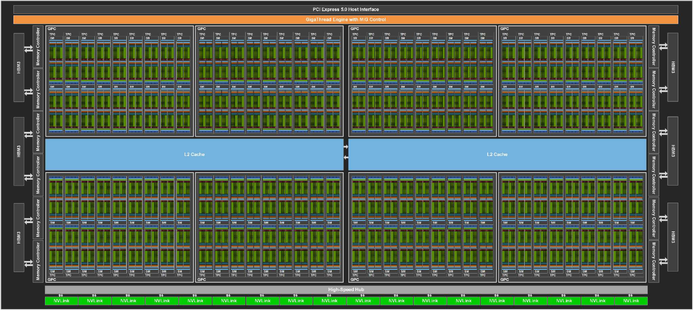
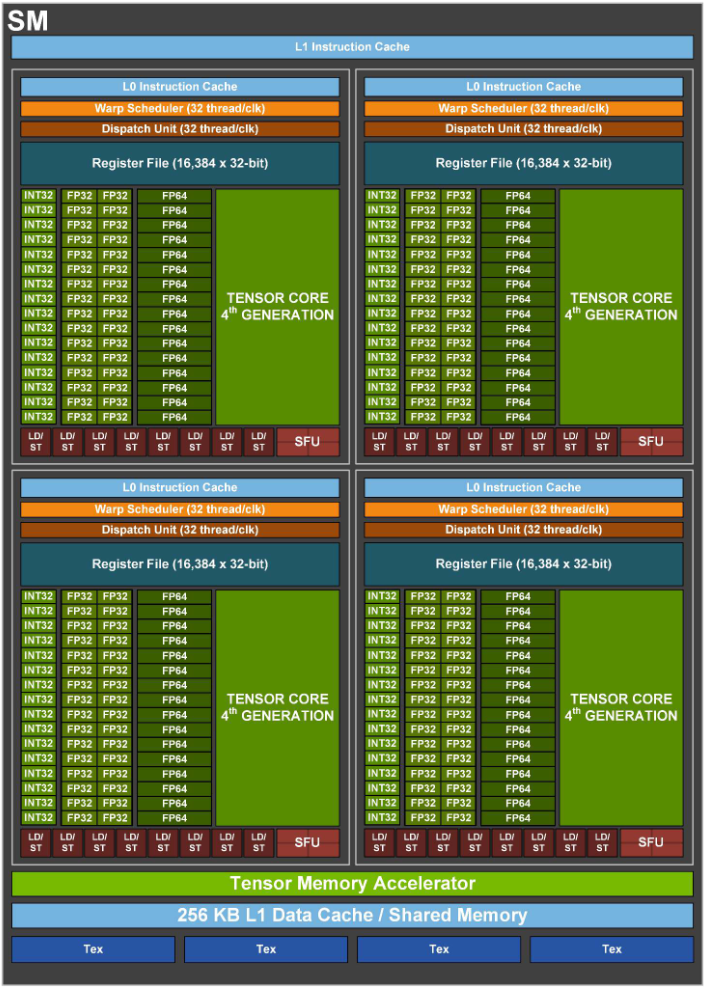

## 1. NVIDIA Hopper ?�키?�처 (H100 SXM5 기�?)

*   **H100 Full GPU with 144 SMs**
  

*   **GH100 Streaming Multiprocessor (SM)**
  

*   **?�일 Tensor Core ?�산 규격 (M, N, K):** **16 x 8 x 32**
*   **Cycle??처리??** **1,024 MACs / Cycle** (?�일 Tensor Core 기�?, INT8)  
    

*   **H100 SXM5 �??��? 구조:**
    *   �???SM 개수: **132�?*
    *   1�?SM ??Tensor Core 개수: **4�?*
    *   **�????�체 Tensor Core 개수: 528�?* (132 x 4)

*   **H100 SXM5 ?�체 ?�산 ?�능 (TOPS) 계산:**
    *   **Peak MACs / Cycle:** 540,672 MACs (528�?× 1,024)
    *   **Peak OPs / Cycle:** 1,081,344 OPs (1 MAC = 2 OPs)
    *   **Clock Frequency:** ??1.83 GHz (Boost Clock 기�?)
    *   **최�? 처리??(INT8 Dense 기�?):** 1,081,344 OPs × 1.83 GHz ??**1,979 TOPS**

> **Reference:**
> *   https://resources.nvidia.com/en-us-hopper-architecture/nvidia-h100-tensor-c
> *   https://docs.nvidia.com/cuda/parallel-thread-execution/index.html

---

## 2. Google TPU v4 ?�키?�처

*   **?�일 MXU 물리??규격:** **128 x 128** (고정??2차원 Systolic Array)
*   **Cycle??처리??** **16,384 MACs / Cycle** (?�일 MXU 기�?, INT8/BF16)
*   **�??��? 구조:**
    *   �???TensorCore 개수: **2�?* (??구�??� �??��???메인 ?�로?�서 블록??'TensorCore'?�고 부�? NVIDIA??Tensor Core보다 ?�씬 ???�위?�며, NVIDIA??Tensor Core?�??명칭�?같고 규모?� ??��???�게 ?�르??)
    *   1�?TensorCore ??MXU 개수: **4�?*
    *   **?�일 �??�체 MXU 개수: 8�?* (2 x 4)

*   **?�체 ?�산 ?�능 (TOPS) 계산:**
    *   **Peak MACs / Cycle:** 131,072 MACs (8�?× 16,384)
    *   **Peak OPs / Cycle:** 262,144 OPs (1 MAC = 2 OPs)
    *   **Clock Frequency:** ??1.05 GHz
    *   **최�? 처리??(INT8 기�?):** 262,144 OPs × 1.05 GHz ??**275 TOPS**

> **Reference:**
> *   https://arxiv.org/abs/2304.01433
> *   https://jax-ml.github.io/scaling-book/tpus/

---

## 3. Hopper vs TPU v4 ?�나리오 비교
???�드?�어 간의 ?��? 차이(체급)�?배제?�고 **?�수 ?�키?�처??구조???�율??*??비교?�기 ?�해, ???�드?�어???�론?�인 Peak MACs/Cycle???�일?�도�?Hopper??SM 개수�?32개로 ?�한?�여 가?�한??
(Hopper 32�?SM: 131,072 MACs/Cycle vs TPU 8�?MXU: 131,072 MACs/Cycle)

### 3.1. Hopper가 ?�리???�나리오: 불규칙하�??��? GEMM ?�수 발생 (?? MoE 추론)

MoE(Mixture of Experts) 추론?�서 Router가 ?�큰??8개의 Expert�?분산??결과, ?�음�?같�? ?��? GEMM?�이 �??��??�서 ?�시?�발?�으�??�행?�다�?가?�한??
�?Expert???�로 ?�른 Weight�??�용?��?�?8�?모두 ?�전???�립?�인 ?�산?�다.

> Expert 0 : 96 × 128 × 128 GEMM  
> Expert 1 : 37 × 128 × 128 GEMM  
> Expert 2 : 142 × 128 × 128 GEMM  
> Expert 3 : 11 × 128 × 128 GEMM  
> Expert 4 : 205 × 128 × 128 GEMM  
> Expert 5 : 64 × 128 × 128 GEMM  
> Expert 6 : 89 × 128 × 128 GEMM  
> Expert 7 : 12 × 128 × 128 GEMM

??8�?Expert???�효 ?�큰 ??M) 총합?� **656�?*?�며, ?��? ?�제 ?�산?�으�??�산?�면 (656 × 128 × 128) MACs가 ?�다. ??불규칙한 ?�이?��? ?�시???�입?�었????발생?�는 지???�간???�치?�하�??�음�?같다.

| ??�� | TPU v4 ?��?(8�?MXU) | Hopper (32�?SM ?�한) |
|---|---|---|
| **?�제 ?�효 ?�산??* | 656 × 128 × 128 MACs | 656 × 128 × 128 MACs |
| **?�상?�인 ?�수 계산** | ??82 Cycles ((656 × 128 × 128) ÷ 131,072) | ??82 Cycles ((656 × 128 × 128) ÷ 131,072) |
| **TPU (병렬) ?�요 Cycle** | **??459 Cycles** (가??�?M=205 ?�기??+ Fill/Drain 254) | ?�당 ?�음 |
| **TPU (직렬) ?�요 Cycle** | **??2,688 Cycles (최악??경우)** (M=656 ?�수 ?�산 + Fill/Drain 8???�적) | ?�당 ?�음 |
| **Hopper ?�요 Cycle** | ?�당 ?�음 | **??82 Cycles + α (?�학???�한)** (?�제로는 Scheduling/Memory Overhead ?��? 추�??? |

* **TPU?�게 불리????(?�적 ?��?줄링 ?�약�?Array Utilization ?�??:** ?�일 TensorCore ?��???MXU?��? 컴파?�러가 ?�성???�행 ?�름??공유?��?�?8개의 불규칙한 Expert ?�산??처리????구조?�인 비효?�이 발생?�다.
    * **병렬 처리 ??(Runtime 불확?�성?�로 ?�한 ??��):** 8개의 MXU?�서 ?�시???�산???�리�?Fill/Drain Overhead(254 Cycle)??1번만 감당?�면 ?�다. ?��?�?MoE ?�경?�서??Expert�??�큰 ?��? '?��??????�적?�로 결정?��?�? TPU??강점??'컴파???�점???�적 분배 �?최적??Packing/Fusion)'�??�용?�기가 ?�렵?? 불균?�한 Expert 분포가 발생?�는 경우 ?��? MXU ?�는 TensorCore???�휴 ?�간??발생?�여 Array Utilization???�?�될 ???�다.
    * **직렬 처리 ??(Pipeline Overhead ?�적):** ?��? 같�? ?�딩 ??���??�하�??�해 �?Expert�??�립?�으�??�차 ?�행?�는 **최악??경우(Worst-case)**, ?�번?�는 �??�업마다 거�???Array�?비우�?채우??Fill/Drain Overhead(254 Cycle)가 8�??�속?�로 ?�적?�어 ?�체 ?�요 Cycle??2,688 ?��??�로 ?�게 증�??�다.
* **Hopper?�게 ?�리????(Warp Scheduler ?�연??�?Latency ?�??:** Hopper??SM?� 각각 ?�자?�인 Warp Scheduler�?가�??�립?�인 ?�닛?�다. ?�한??32개의 SM�??�용?�더?�도, 8개의 Expert ?�산???�유�?�� 쪼개???��? 병렬?�을 ?��??????�다.
    * M=11짜리 ?�업???�나�??�당 SM?��? 즉시 ?�음 ?�업???�행?�거???�른 곳에 ?�입?????�으�? 가??�??�업(M=205)???�도??맞출 ?�요가 ?�다.
    * Hopper???�업??CTA, Warp, Tensor Core ?�산 ?�위�?계층?�으�?분할?�여 부?��? ?�연?�게 분산?????�으므�? ?��? GEMM?�서??TPU보다 ?�원 ?�용률을 ?��??�기 ?�다. ?�한 Pipeline Latency??Warp Scheduler???�해 ?�부�??�?�된??
* **결론:** ??칩의 물리??처리 ?�력(Peak MACs/Cycle)??131,072�??�일?�게 주어지?�라?? TPU???�적 ?��?줄링 ?�약?�로 ?�해 ?�제 ?�요 ?�간??459 Cycle ?�상?�로 ?�어지??반면, Hopper??TPU보다 ?�론??계산 ?�한(82 cycle)???��??�으�???근접???�행 ?�간??기�??????�다. ?�것??MoE 추론 ?�경?�서 Hopper???�키?�처가 ???�리???�유?�다.

### 3.2. TPU가 ?�리???�나리오: ?�규모 ?�규 GEMM (?? LLM ?�규모 Prompt Prefill)

?�천~?�만 개의 ?�큰????번에 처리?�는 LLM??Prompt Prefill(?�력 처리) ?�황??가?�한?? `Batch Size × Sequence Length` = 8,192?�고, `Hidden Dimension`??4,096??거�????�일 GEMM ?�산?�라�?가?�해 보자.

> ?�일 거�? ?�산: 8,192 × 4,096 × 4,096 GEMM

???�일 ?�산???�제 ?�산?��? **8,192 × 4,096 × 4,096 MACs**?�다.
??거�??�고 규칙?�인 ?�이?��? 칩에 ?�입?�었????발생?�는 ?�황???�치?�하�??�음�?같다.

| ??�� | TPU v4 ?��?(8�?MXU) | Hopper (32�?SM ?�한) |
|---|---|---|
| **?�제 ?�효 ?�산??* | 8,192 × 4,096 × 4,096 MACs | 8,192 × 4,096 × 4,096 MACs |
| **?�상?�인 ?�수 계산** | 1,048,576 Cycles ((8,192 × 4,096 × 4,096) ÷ 131,072) | 1,048,576 Cycles ((8,192 × 4,096 × 4,096) ÷ 131,072) |
| **TPU ?�요 Cycle** | **1,048,830 Cycles** (?�수 ?�산 1,048,576 + Fill/Drain 254) | ?�당 ?�음 |
| **Hopper ?�요 Cycle** | ?�당 ?�음 | **1,048,576 Cycles + β** (Kernel Launch, Memory Latency, Tile ?�기???�의 Overhead ?�함) |

* **TPU?�게 ?�리????(Systolic Array??고연??밀??:**
    * **Zero-padding 불필??** ?�산 ?�기(8,192, 4,096 ??가 TPU??128×128 Array ?�기???�벽?�게 ?�누?�떨?��?므�?�?공간??발생?��? ?�는?? ?�라??Array Utilization??100%??근접?�다.
    * **Overhead ?�쇄 (Weight Double Buffering ?�제):** �?PE가 Weight Register�?2�?보유?��?�? ?�재 ?�???�산 중에 ?�음 ?�?�의 Weight�?백그?�운?�로 미리 로드?????�다. ?�상?�인 ?�일 GEMM ?�행�?충분??메모�??�??��???�보?�다???�제 ?�에, Fill/Drain Overhead??최초 Fill�?최종 Drain???�당?�는 ??254 Cycle�?발생?�며, ?�체 ?�행 ?�간 ?��???0.02% ?��??�로 무시?????�다.
    * **명령???�어 로직 최소??** ?�수??고수준 MatrixMultiply 명령??중심?�로 매우 �?Dense GEMM???�속?�으�??�행?????�다. GPU처럼 �?SM?�서 Warp Scheduler?� Instruction Fetch/Decode ???�적 ?�행???�한 ?�어 로직??지?�적?�로 ?�작?�킬 ?�요가 ?�으므�? ?�어 로직???�모?�는 ?�력??줄이?????�리?�여 Dense GEMM 중심???�크로드?�서 ?��? ?�성비�? ?�성?�도�??�계?�어 ?�다.
* **Hopper?�게 불리????(Control Logic Overhead):**
    * **?�적 ?��?줄링 ?�버?�드 ?�적:** GPU??Warp Scheduler, Instruction Fetch/Decode, Register Scoreboard, Shared Memory 관�????�적 ?�행???�한 ?�어 로직??지?�적?�로 ?�작?�켜???�다. ?�러??구조???�양???�크로드???�???��? ?�연?�을 ?�공?��?�? Dense GEMM�?반복?�는 ?�황?�서??TPU보다 ??많�? ?�어 ?�드?�어?� ?�력 ?�모�??�구?�다.
* **결론:** Hopper ??�� ?�산 ?�도 ?�체???�상?�인 ?�치(1,048,576 Cycle)??근접?�게 처리???�겠지�? �?과정?�서 Control Logic Overhead�??�한 ?�력 ?�모가 발생?�다. TPU??Dense GEMM 처리???�요???�산 밀?��? ?�이�??�어 구조�??�순?�한 ?�키?�처?��?�? ?�러???�크로드?�서 ?��? ?�성비�? ?�성?�도�??�계?�어 ?�다.
