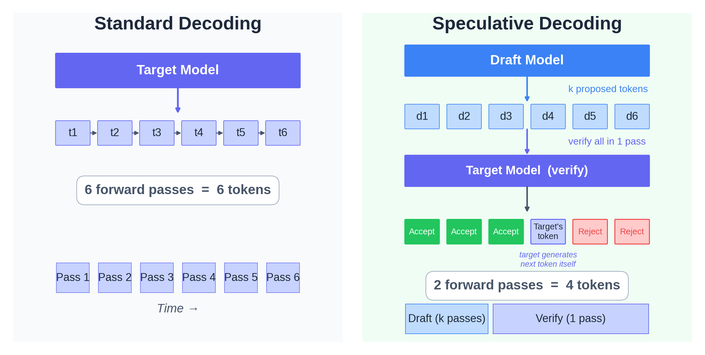

# 모델 개요

- 요즘 대부분 MoE만 쓰는데 Dense Model도 개발
- E2B, E4B 모델은 타겟 하드웨어가 온디바이스이므로 VRAM 용량을 줄이기 위함
- 26B-A4B 모델은 VRAM 여유가 있는 워크스테이션이나 서버에서 31B Dense 모델에 근접하는 성능을 4B 모델 수준의 지연 시간으로 얻기 위함
- E4B 모델은 파라미터 수가 Gemma 3 27B의 1/6에 불과하지만 모든 벤치마크에서 능가


# Per-Layer Embedding (PLE)

- Reference: https://newsletter.maartengrootendorst.com/p/a-visual-guide-to-gemma-4
- 온디바이스에서 연산량을 줄이기 위해 룩업 테이블 기반의 PLE를 도입
- PLE 이점
    - 지식 저장소의 분리: Attention은 문맥 파악에 집중하고, PLE는 고정된 사실이나 지식을 저장하는 방향으로 학습
    - Diversed Feature Extraction: 동일한 입력에 대해 서로 다른 관점의 특징 추출
    - Decoder Block Layer 수를 줄이는 대신 FFN Layer에 Element-wise multiplication 연산을 추가해서 Processing 부담을 줄임
- 위 장점만 봤을 때는 큰 모델에서도 적용하지 않을 이유가 없어보이는데?
    - 큰 모델에서는 Decode Stage에서는 이미 IO Bound에 걸려있으므로 Processing Cycle을 줄이는게 크게 의미 없음.
    - 대형 모델에서는 이미 충분히 큰 파라미터 수를 가지고 있으므로 PLE보다는 MoE로 연산량은 줄이되 Dense 모델에 근접한 성능을 내는 것이 나음.


# Speculative Decoding

## 동작원리
- https://arxiv.org/abs/2211.17192
- 
- Autoregressive 방식은 한 개 토큰을 추측하는 방식이라서 Decode Stage에서 Vector by Matrix 문제에서 Processing / IO 밸런스가 맞지 않던 것을 Speculative Decoding을 통해 Processing 비율을 늘릴 수 있게 됨.
- Draft Model (e.g., google/gemma-4-E4B-it-assistant) 은 Target Model (e.g., google/gemma-4-E4B-it) 이 생성한 KV Cache를 공유할 수 있음.
    - 모델 파라미터가 78.8M params vs 8B params로 한참 차이나는데 어떻게? 그리고 어떤 레이어의 KV Cache를 공유?
    - Gemma 4 ships with a small "assistant" head that predicts several future tokens from the target model's last hidden state. 
    - Draft Model의 config.json을 보면 KV Cache를 공유하기 위한 조건이 만족되도록 설계되어 있는 것으로 보임.
    - <details>
        <summary>config.json</summary>
        "backbone_hidden_size": 2560, <br>
        "global_head_dim": 512, <br>
        "head_dim": 256, <br>
        "num_hidden_layers": 4, <br> 
        "num_key_value_heads": 2, <br>
        "num_kv_shared_layers": 4, <br>
      </details>
- 두 모델을 병렬로 돌리려는 시도 (Staged Speculative Decoding)도 있지만, 기본적으로 Sequential하게 동작
    - Target Model이 Accept 결정을 하기 전에 Draft Model이 다음 토큰 묶음을 미리 예측하는 방식인데, Accept, Reject 결과에 따라 컨트롤이 어려울 듯.

## Huggingface 구현
```python
model.generate()
  └── GenerationMixin.generate()
        └── _assisted_decoding()
              ├── AssistedCandidateGenerator.get_candidates()
              │     └── assistant_model.forward()  # draft 토큰 N개 생성 (N번의 forward pass)
              ├── target_model.forward()            # N개 토큰 병렬 검증  (1번의 forward pass)
              └── _speculative_sampling()           # reject sampling으로 수락/거부
```

## 이슈
https://news.hada.io/topic?id=29219

- 요약: Google이 MTP로 학습시킨 Gemma 4에서 해당 기능을 공개 배포판에서 제거했다가, 커뮤니티의 리버스 엔지니어링으로 들통난 후 외부 보조 모델 형태로 뒤늦게 지원을 시작
- 발단: HuggingFace에 공개된 표준 모델 가중치에는 존재하지 않는 MTP(Multi-Token Prediction, 다중 토큰 예측) 아키텍처가 엣지용 컴파일 파일에만 포함
- Google의 변명: "MTP 관련 예측 헤드는 HuggingFace Transformers API와의 호환성을 위해 공개 모델에서 의도적으로 제외했다. LiteRT 런타임에는 온디바이스 성능 향상을 위해 보존했다." 
- 미문서화 비판: MTP로 학습시켜 놓고 공개 배포판에서 고의로 제거하면서 아무런 언급도 없었다는 점.
- 상업적 의도 의혹: "로컬에서 구동되는 오픈소스 31B 모델이 너무 빨라지면 자사 상용 API(Flash Lite 등)의 경쟁력을 위협하기 때문에 의도적으로 너프했다"는 주장.