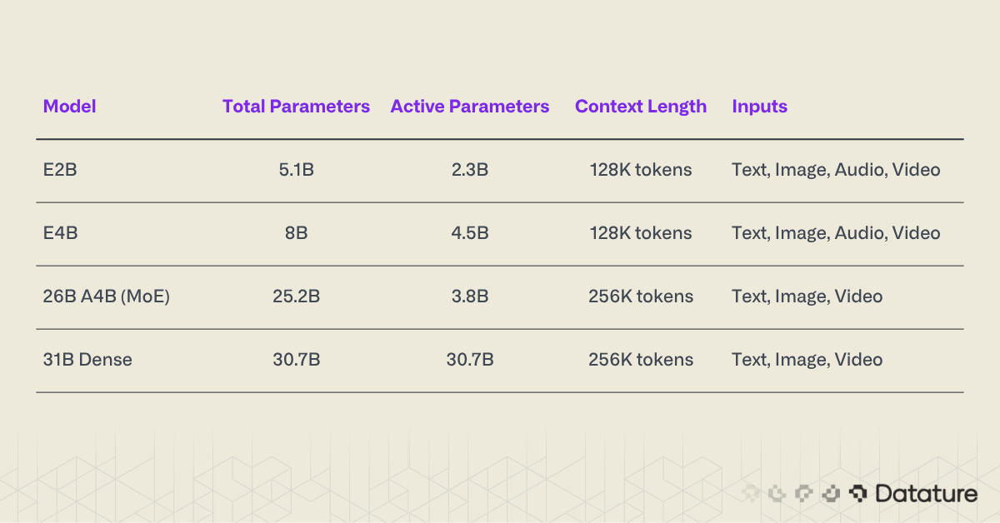
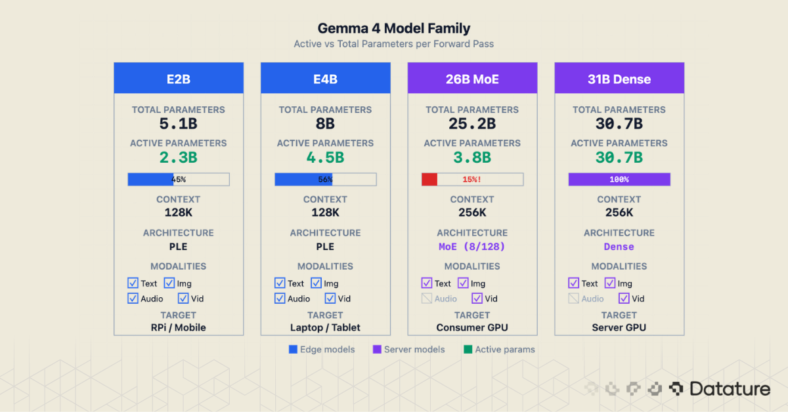
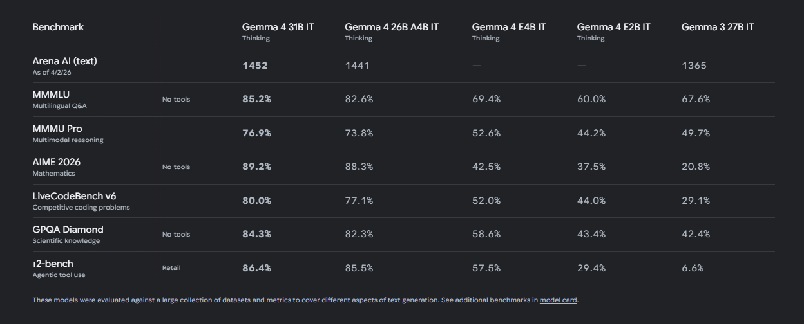
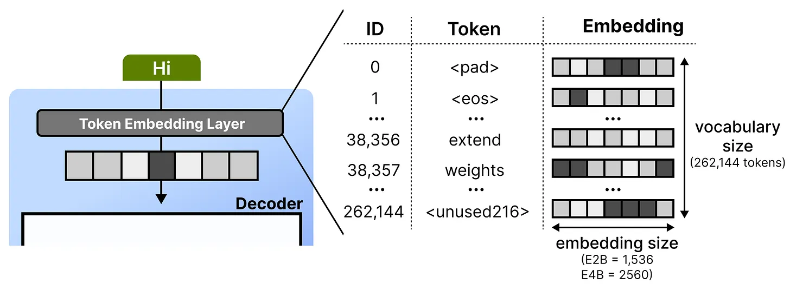
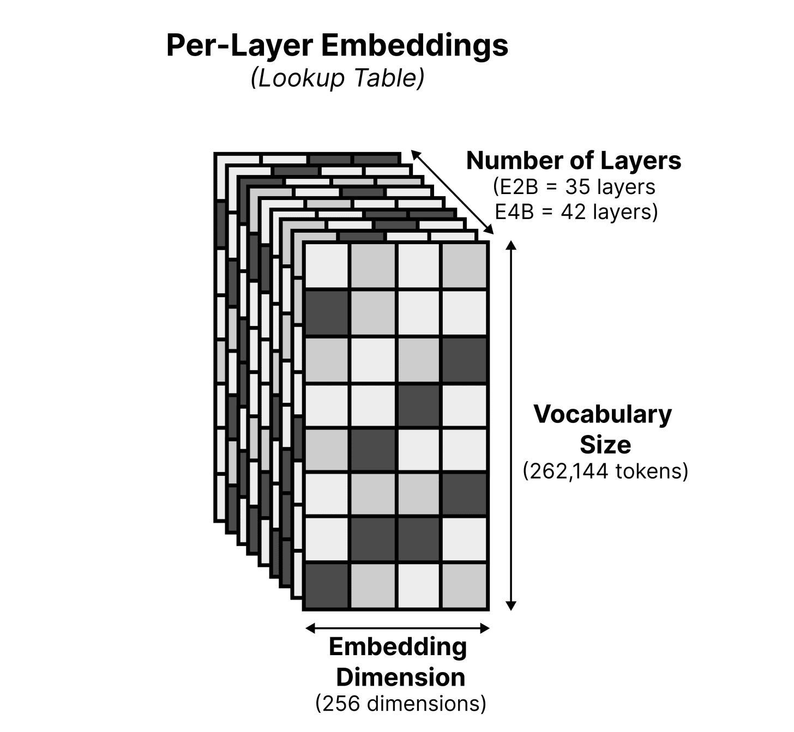
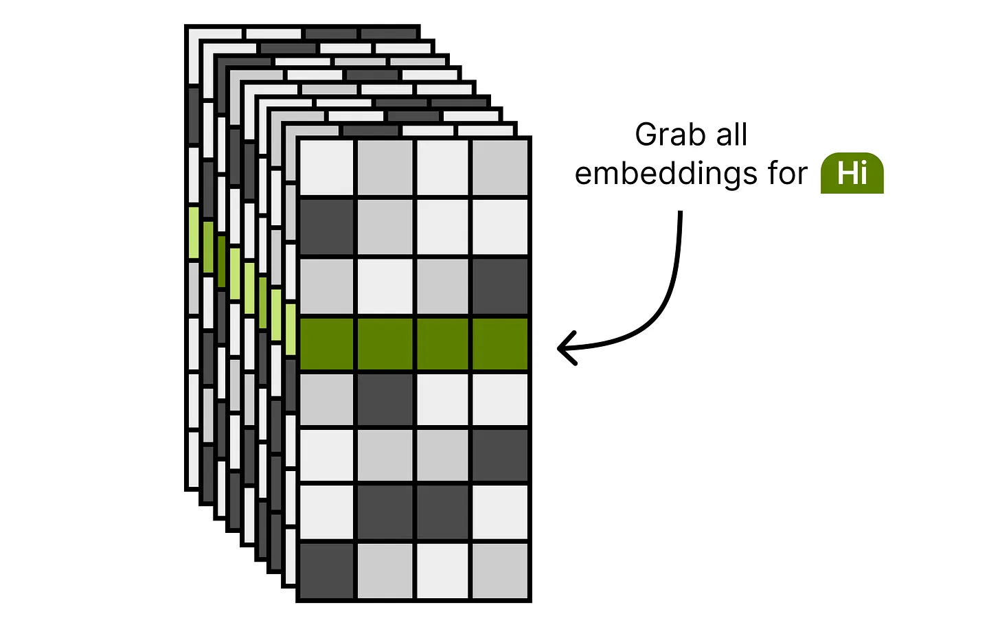
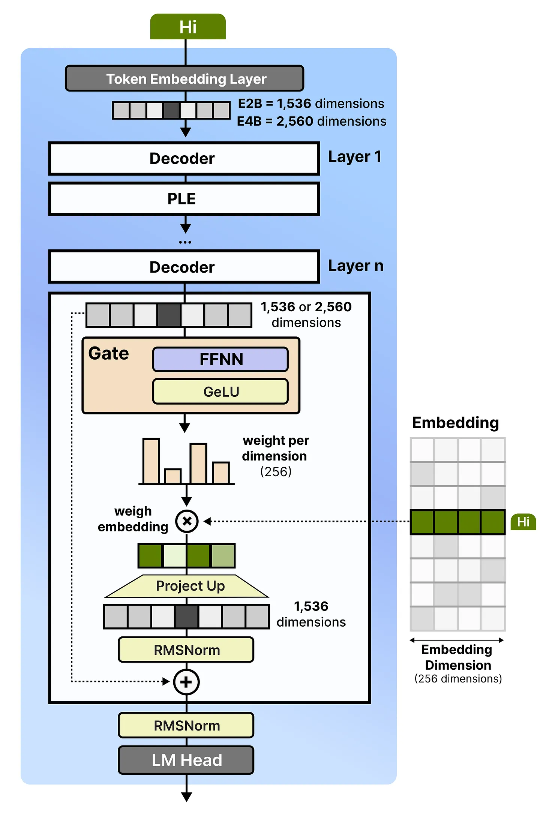

# 모델 개요

- 요즘 대부분 MoE만 쓰는데 Dense Model도 개발
- E2B, E4B 모델은 타겟 하드웨어가 온디바이스이므로 VRAM 용량을 줄이기 위함
- 26B-A4B 모델은 VRAM 여유가 있는 워크스테이션이나 서버에서 31B Dense 모델에 근접하는 성능을 4B 모델 수준의 지연 시간으로 얻기 위함
- E4B 모델은 파라미터 수가 Gemma 3 27B의 1/6에 불과하지만 모든 벤치마크에서 능가

# Per-Layer Embedding (PLE)

- Reference: https://newsletter.maartengrootendorst.com/p/a-visual-guide-to-gemma-4
- 온디바이스에서 연산량을 줄이기 위해 룩업 테이블 기반의 PLE를 도입
- PLE 이점
    - 지식 저장소의 분리: Attention은 문맥 파악에 집중하고, PLE는 고정된 사실이나 지식을 저장하는 방향으로 학습
    - Diversed Feature Extraction: 동일한 입력에 대해 서로 다른 관점의 특징 추출
    - Decoder Block Layer 수를 줄이는 대신 FFN Layer에 Element-wise multiplication 연산을 추가해서 Processing 부담을 줄임
- 위 장점만 봤을 때는 큰 모델에서도 적용하지 않을 이유가 없어보이는데?
    - 큰 모델에서는 Decode Stage에서는 이미 IO Bound에 걸려있으므로 Processing Cycle을 줄이는게 크게 의미 없음.
    - 또한, Parameter Efficiency 관점에서 MoE를 사용 중.

