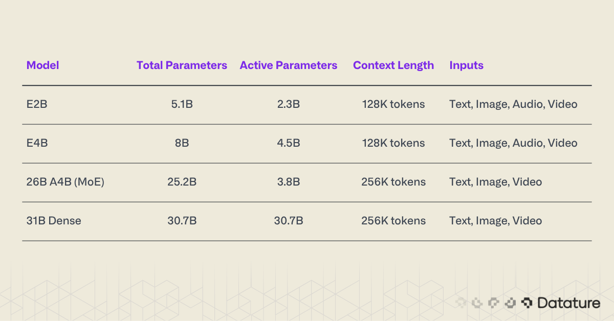
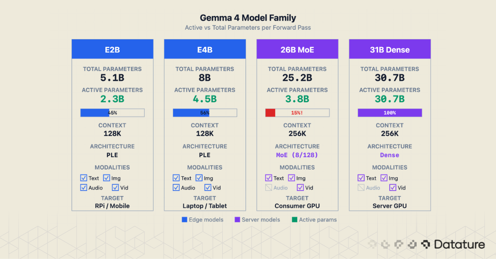
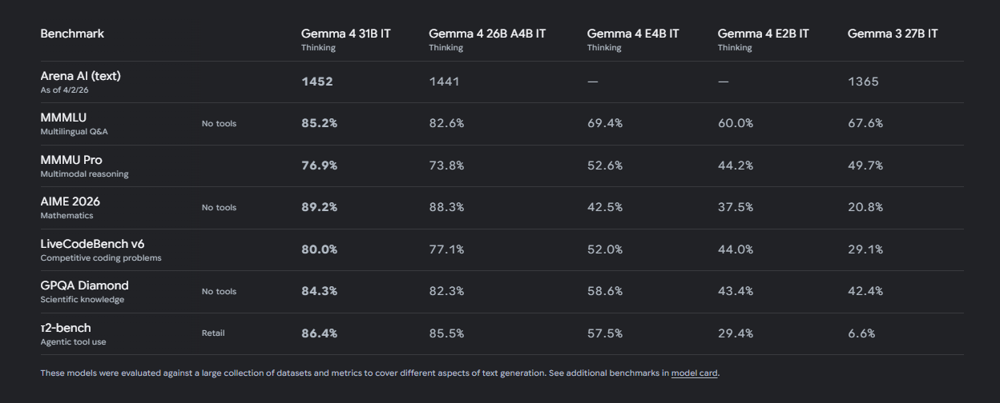
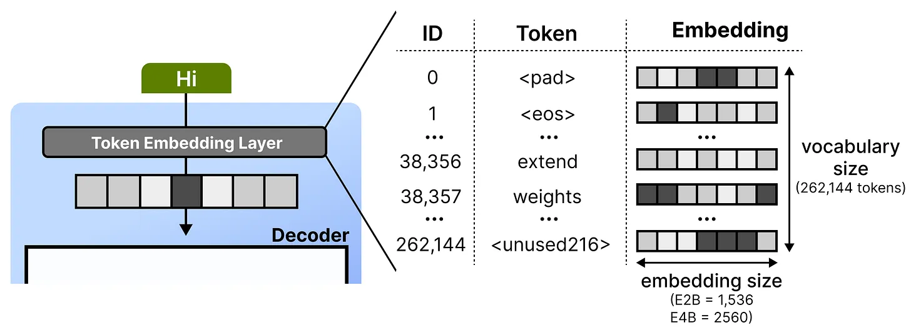
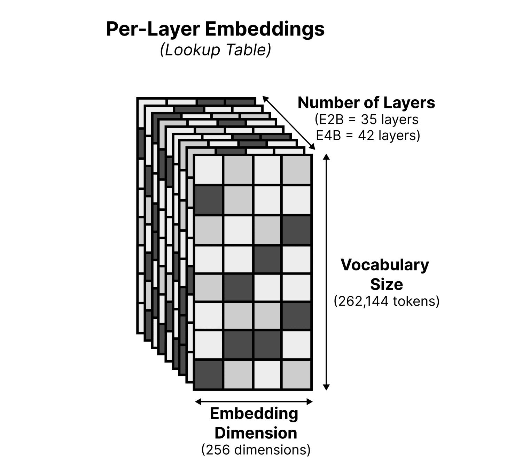
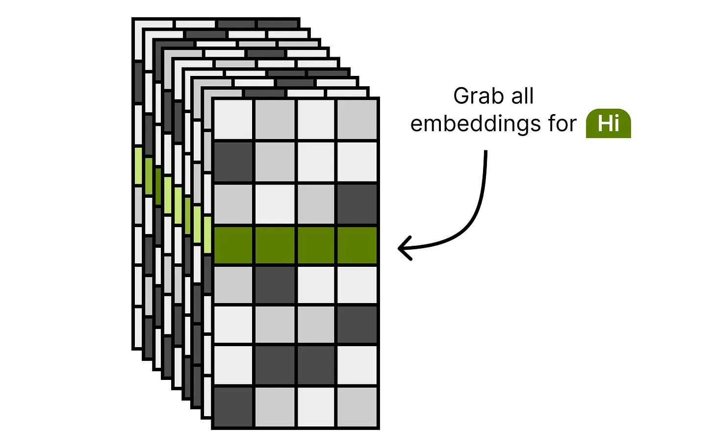
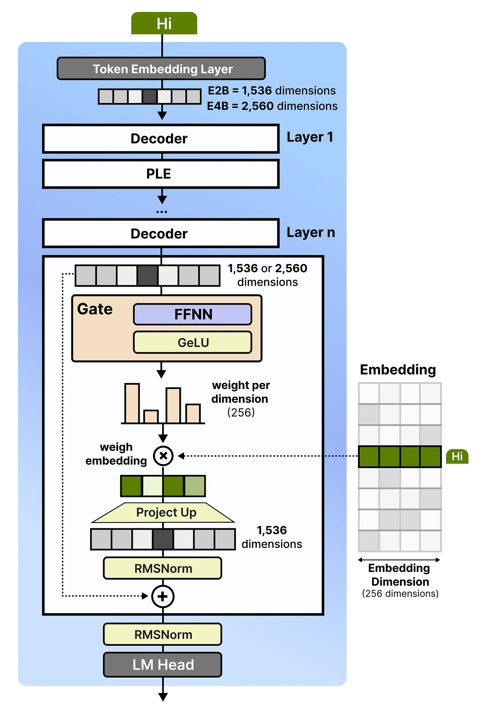
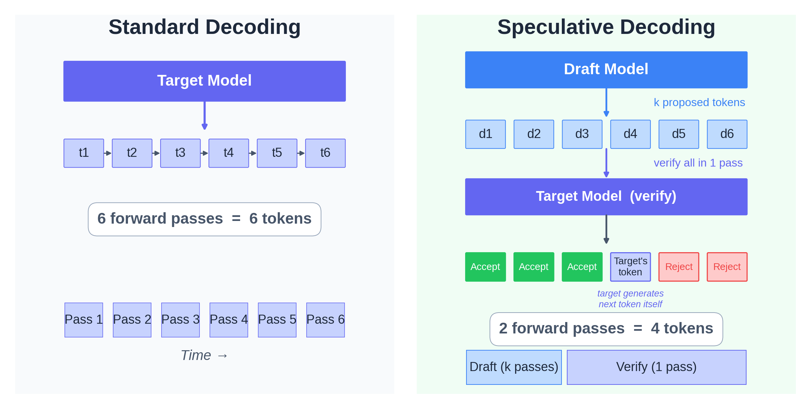
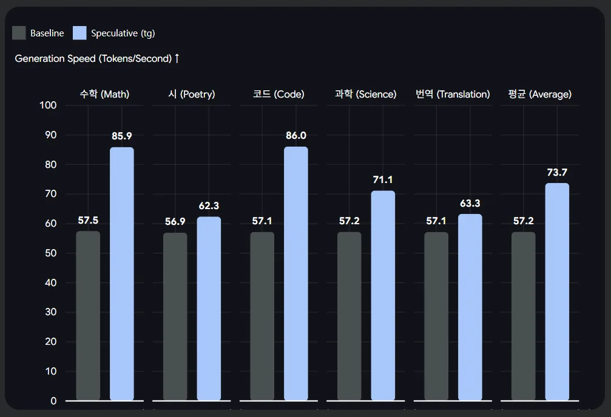

# 모� 개요

- ?”즘 ?€ë¶€ë¶?MoEë§??°ëŠ”??Dense Model??개발
- E2B, E4B 모ë�¸?€ ?€ê²??˜ë“œ?¨ì–´ê°€ ?¨ë””ë°”ì�´?¤ì�´ë¯€ë¡?VRAM ?©ëŸ‰??줄ì�´ê¸??„함
- 26B-A4B 모ë�¸?€ VRAM ?¬ìœ ê°€ ?ˆëŠ” ?Œí�¬?¤í…Œ?´ì…˜?´ë‚˜ ?œë²„?�ì„œ 31B Dense 모ë�¸??근접?˜ëŠ” ?±ëŠ¥??4B 모ë�¸ ?˜ì???지???œê°„?¼ë¡œ ?»ê¸° ?„함
- E4B 모ë�¸?€ ?Œë�¼ë¯¸í„° ?˜ê? Gemma 3 27B??1/6??불과?˜ì?ë§?모든 벤치마í�¬?�ì„œ ?¥ê?





# Per-Layer Embedding (PLE)

- Reference: https://newsletter.maartengrootendorst.com/p/a-visual-guide-to-gemma-4
- ?¨ë””ë°”ì�´?¤ì—�???°ì‚°?‰ì�„ 줄ì�´ê¸??„í•´ 룩업 ?Œì�´ë¸?기반??PLEë¥??„ì�…
- PLE ?´ì �
    - 지???€?¥ì†Œ??분리: Attention?€ 문맥 ?Œì•…??집중?˜ê³ , PLE??ê³ ì •???¬ì‹¤?´ë‚˜ 지?�ì�„ ?€?¥í•˜??ë°©í–¥?¼ë¡œ ?™ìŠµ
    - Diversed Feature Extraction: ?™ì�¼???…ë ¥???€???œë¡œ ?¤ë¥¸ ê´€?�ì�˜ ?¹ì§• 추출
    - Decoder Block Layer ?˜ë? 줄ì�´???€??FFN Layer??Element-wise multiplication ?°ì‚°??추ê??´ì„œ Processing 부?´ì�„ 줄ì�„
- ???¥ì �ë§?ë´¤ì�„ ?ŒëŠ” ??모ë�¸?�ì„œ???�ìš©?˜ì? ?Šì�„ ?´ìœ ê°€ ?†ì–´ë³´ì�´?”ë�°?
    - ??모ë�¸?�ì„œ??Decode Stage?�ì„œ???´ë? IO Bound??걸려?ˆìœ¼ë¯€ë¡?Processing Cycle??줄ì�´?”게 ?¬ê²Œ ?˜ë? ?†ì�Œ.
    - ?€??모ë�¸?�ì„œ???´ë? 충분?????Œë�¼ë¯¸í„° ?˜ë? 가지ê³??ˆìœ¼ë¯€ë¡?PLE보다??MoEë¡??°ì‚°?‰ì? 줄ì�´??Dense 모ë�¸??근접???±ëŠ¥???´ëŠ” 것ì�´ ?˜ì�Œ.






# Speculative Decoding

## ?™ì�‘?�리
- https://arxiv.org/abs/2211.17192
- 
- Autoregressive ë°©ì‹�?€ ??ê°?? í�°??추측?˜ëŠ” ë°©ì‹�?´ë�¼??Decode Stage?�ì„œ Vector by Matrix 문제?�ì„œ Processing / IO 밸런?¤ê? ë§�ì? ?Šë�˜ 것ì�„ Speculative Decoding???µí•´ Processing 비율???˜ë¦´ ???ˆê²Œ ??
- Draft Model (e.g., google/gemma-4-E4B-it-assistant) ?€ Target Model (e.g., google/gemma-4-E4B-it) ???�성??KV Cacheë¥?공유?????ˆì�Œ.
    - 모ë�¸ ?Œë�¼ë¯¸í„°ê°€ 78.8M params vs 8B paramsë¡??œì°¸ ì°¨ì�´?˜ëŠ”???´ë–»ê²? 그리ê³??´ë–¤ ?ˆì�´?´ì�˜ KV Cacheë¥?공유?
    - Gemma 4 ships with a small "assistant" head that predicts several future tokens from the target model's last hidden state. 
    - Draft Model??config.json??ë³´ë©´ KV Cacheë¥?공유?˜ê¸° ?„í•œ ì¡°ê±´??만족?˜ë�„ë¡??¤ê³„?˜ì–´ ?ˆëŠ” 것으ë¡?ë³´ì�„.
    - <details>
        <summary>config.json</summary>
        "backbone_hidden_size": 2560, <br>
        "global_head_dim": 512, <br>
        "head_dim": 256, <br>
        "num_hidden_layers": 4, <br> 
        "num_key_value_heads": 2, <br>
        "num_kv_shared_layers": 4, <br>
      </details>
- ??모ë�¸??병렬ë¡??Œë¦¬?¤ëŠ” ?œë�„ (Staged Speculative Decoding)???ˆì?ë§? 기본?�으ë¡?Sequential?˜ê²Œ ?™ì�‘
    - Target Model??Accept ê²°ì •???˜ê¸° ?„ì—� Draft Model???¤ì�Œ ? í�° 묶ì�Œ??미리 ?ˆì¸¡?˜ëŠ” ë°©ì‹�?¸ë�°, Accept, Reject ê²°ê³¼???°ë�¼ 컨트롤ì�´ ?´ë ¤????

## Huggingface 구현
```python
model.generate()
  ?”â??€ GenerationMixin.generate()
        ?”â??€ _assisted_decoding()
              ?œâ??€ AssistedCandidateGenerator.get_candidates()
              ??    ?”â??€ assistant_model.forward()  # draft ? í�° Nê°??�성 (N번ì�˜ forward pass)
              ?œâ??€ target_model.forward()            # Nê°?? í�° 병렬 ê²€ì¦? (1번ì�˜ forward pass)
              ?”â??€ _speculative_sampling()           # reject sampling?¼ë¡œ ?˜ë�½/ê±°ë?
```

## ?±ëŠ¥ (Decoding Tput)
### Light User ê´€??
- https://developer-blogs.nvidia.com/wp-content/uploads/2025/09/speculative-decoding-on-off.gif

### Benchmark
- 
- 출처: https://www.reddit.com/r/LocalLLaMA/comments/1sjct6a/speculative_decoding_works_great_for_gemma_4_31b/?solution=281a0ed603877bc8281a0ed603877bc8&js_challenge=1&token=7afd7253fec22262ff1c52b1703fe9ec7fe009426c8f7f6113d08be287d18ff1&jsc_orig_r=

### Self Experiment
- Tested on H100

#### Prompt-heavy: 8000 input / 1000 output
| 지??(Metric) | Qwen/Qwen3-Coder-30B-A3B-Instruct-FP8 | google/gemma-4-26B-A4B-it wo/ SD | google/gemma-4-26B-A4B-it w/ SD |
| :--- | :--- | :--- | :--- |
| **Successful requests** | 16 | 16 | 16 |
| **Failed requests** | 0 | 0 | 0 |
| **Maximum request concurrency** | 1 | 1 | 1 |
| **Benchmark duration (s)** | 95.41 | 106.69 | 121.42 |
| **Total input tokens** | 128,000 | 128,000 | 128,000 |
| **Total generated tokens** | 16,000 | 16,000 | 16,000 |
| **Request throughput (req/s)** | 0.17 | 0.15 | 0.13 |
| **Output token throughput (tok/s)** | 167.69 | 149.97 | 131.78 |
| **Peak output token throughput (tok/s)** | 175.00 | 163.00 | 50.00 |
| **Peak concurrent requests** | 2.00 | 2.00 | 2.00 |
| **Total token throughput (tok/s)** | 1509.20 | 1349.69 | 1185.98 |
| **Mean TTFT (ms)** | 219.48 | 437.15 | 490.21 |
| **Median TTFT (ms)** | 261.13 | 430.10 | 482.46 |
| **P99 TTFT (ms)** | 315.53 | 592.80 | 643.24 |
| **Mean TPOT (ms)** | 5.75 | 6.24 | 7.10 |
| **Median TPOT (ms)** | 5.76 | 6.23 | 5.94 |
| **P99 TPOT (ms)** | 5.77 | 6.27 | 19.86 |
| **Mean ITL (ms)** | 5.75 | 6.25 | 20.89 |
| **Median ITL (ms)** | 5.76 | 6.26 | 20.94 |
| **P99 ITL (ms)** | 6.18 | 6.45 | 22.19 |
| **SD Acceptance rate (%)** | - | - | 48.62 |
| **SD Acceptance length** | - | - | 2.94 |
| **SD Drafts** | - | - | 5435 |
| **SD Draft tokens** | - | - | 21740 |
| **SD Accepted tokens** | - | - | 10569 |
| **SD Position 0 acceptance (%)** | - | - | 62.85 |
| **SD Position 1 acceptance (%)** | - | - | 52.51 |
| **SD Position 2 acceptance (%)** | - | - | 42.32 |
| **SD Position 3 acceptance (%)** | - | - | 36.78 |

- SD 켠게 ???ˆì¢‹??WHY??????
    - Draft Model??Long Context 처리 ?¨ìœ¨???¨ì–´ì§€ë¯€ë¡?8k ?…ë ¥???€?´ì„œ??Acceptance Rate???¨ì–´ì§€??것으ë¡?ë³´ì�„.
    - 그러므ë¡? SD ?†ì�´ Autoregressive?˜ê²Œ ?™ì�‘??모ë�¸???˜ì? ?˜ì??¼ë¡œ TPê°€ ?€??
    - 추ê??�으ë¡? Balance ?œë‚˜ë¦¬ì˜¤??비해 ?ˆì¸¡???€?¸ì�„ ??가지??penaltyê°€ ????(input tokensê°€ ??길어??decoding ?¨ê³„?�ì„œ ?Œìš”?˜ëŠ” ?œê°„????길기 ?Œë¬¸)

#### Decode-heavy: 1000 input / 8000 output
| 지??(Metric) | Qwen/Qwen3-Coder-30B-A3B-Instruct-FP8 | google/gemma-4-26B-A4B-it wo/ SD | google/gemma-4-26B-A4B-it w/ SD |
| :--- | :--- | :--- | :--- |
| **Successful requests** | 16 | 16 | 16 |
| **Failed requests** | 0 | 0 | 0 |
| **Maximum request concurrency** | 1 | 1 | 1 |
| **Benchmark duration (s)** | 727.30 | 742.57 | 515.01 |
| **Total input tokens** | 16,000 | 16,000 | 16,000 |
| **Total generated tokens** | 128,000 | 128,000 | 128,000 |
| **Request throughput (req/s)** | 0.02 | 0.02 | 0.03 |
| **Output token throughput (tok/s)** | 175.99 | 172.37 | 248.54 |
| **Peak output token throughput (tok/s)** | 181.00 | 190.00 | 86.00 |
| **Peak concurrent requests** | 2.00 | 2.00 | 2.00 |
| **Total token throughput (tok/s)** | 197.99 | 193.92 | 279.60 |
| **Mean TTFT (ms)** | 65.09 | 39.53 | 52.74 |
| **Median TTFT (ms)** | 66.81 | 39.99 | 51.68 |
| **P99 TTFT (ms)** | 73.15 | 43.30 | 72.59 |
| **Mean TPOT (ms)** | 5.67 | 5.80 | 4.02 |
| **Median TPOT (ms)** | 5.67 | 5.79 | 3.47 |
| **P99 TPOT (ms)** | 5.68 | 5.82 | 6.52 |
| **Mean ITL (ms)** | 5.67 | 5.80 | 16.31 |
| **Median ITL (ms)** | 5.68 | 5.80 | 16.21 |
| **P99 ITL (ms)** | 5.96 | 6.36 | 21.97 |
| **SD Acceptance rate (%)** | - | - | 76.55 |
| **SD Acceptance length** | - | - | 4.06 |
| **SD Drafts** | - | - | 31515 |
| **SD Draft tokens** | - | - | 126060 |
| **SD Accepted tokens** | - | - | 96493 |
| **SD Position 0 acceptance (%)** | - | - | 85.69 |
| **SD Position 1 acceptance (%)** | - | - | 78.32 |
| **SD Position 2 acceptance (%)** | - | - | 71.49 |
| **SD Position 3 acceptance (%)** | - | - | 70.69 |

- ?¤ë¥¸ ì¼€?´ìŠ¤??비해 Decode-heavy ì¼€?´ìŠ¤??Acceptance rate???‰ê· ?�으ë¡??’게 ?˜ì˜¤?”ë�° ?œì�¼ê¹?
    - ?¤ë¥¸ ??ì¼€?´ìŠ¤??Acceptance rate????50%?´ê³  ?´ë‹¹ ì¼€?´ìŠ¤????70~80%
    - 먼ì?, Prompt-Heavy??경우, Draft Model?�게??ê¸?문맥?????ˆì�Œ.
    - Decode-Heavy?�ì„œ??input tokenê³?output token ?©ì�´ 8kë¥??˜ì–´ê°€ë©??‘ê°™?€ ê²??„닌지? => ?¨ì�´ 만든 문맥 vs. ?¤ìŠ¤ë¡?만든 컨í…�?¤íŠ¸. ?„ì��ê°€ ???ˆì¸¡?˜ê¸° ?¬ìš¸ ê²?
    - Balanced??경우, ?…출??Total 2ì²?? í�°?€ 문ì�¥ ?„환?´ë‚˜ ?ˆë¡œ???•ë³´ê°€ ?˜ì˜¬ ?•ë¥ ???’ì•„ ?”트로피가 ?�ë??�으ë¡??’ì�„ ???ˆì�Œ.

#### Balanced: 1000 input / 1000 output
| 지??(Metric) | Qwen/Qwen3-Coder-30B-A3B-Instruct-FP8 | google/gemma-4-26B-A4B-it wo/ SD | google/gemma-4-26B-A4B-it w/ SD |
| :--- | :--- | :--- | :--- |
| **Successful requests** | 16 | 16 | 16 |
| **Failed requests** | 0 | 0 | 0 |
| **Maximum request concurrency** | 1 | 1 | 1 |
| **Benchmark duration (s)** | 91.14 | 89.48 | 70.38 |
| **Total input tokens** | 16,000 | 16,000 | 16,000 |
| **Total generated tokens** | 16,000 | 16,000 | 16,000 |
| **Request throughput (req/s)** | 0.18 | 0.18 | 0.23 |
| **Output token throughput (tok/s)** | 175.56 | 178.82 | 227.33 |
| **Peak output token throughput (tok/s)** | 181.00 | 190.00 | 83.00 |
| **Peak concurrent requests** | 2.00 | 2.00 | 2.00 |
| **Total token throughput (tok/s)** | 351.11 | 357.63 | 454.65 |
| **Mean TTFT (ms)** | 93.50 | 258.04 | 394.95 |
| **Median TTFT (ms)** | 114.15 | 69.64 | 85.01 |
| **P99 TTFT (ms)** | 134.28 | 2633.03 | 4295.53 |
| **Mean TPOT (ms)** | 5.61 | 5.34 | 4.01 |
| **Median TPOT (ms)** | 5.57 | 5.33 | 3.36 |
| **P99 TPOT (ms)** | 5.91 | 5.36 | 9.06 |
| **Mean ITL (ms)** | 5.61 | 5.34 | 12.60 |
| **Median ITL (ms)** | 5.57 | 5.34 | 12.55 |
| **P99 ITL (ms)** | 6.41 | 5.56 | 13.99 |
| **SD Acceptance rate (%)** | - | - | 53.72 |
| **SD Acceptance length** | - | - | 3.15 |
| **SD Drafts** | - | - | 5085 |
| **SD Draft tokens** | - | - | 20340 |
| **SD Accepted tokens** | - | - | 10927 |
| **SD Position 0 acceptance (%)** | - | - | 67.59 |
| **SD Position 1 acceptance (%)** | - | - | 57.01 |
| **SD Position 2 acceptance (%)** | - | - | 45.39 |
| **SD Position 3 acceptance (%)** | - | - | 44.90 |

- Peak output token throughput 계산??SD ?�ìš©???œë?ë¡??˜ì? ?Šì? ????Peakê°€ ?‰ê· ì¹˜ë³´????œ¼ë¯€ë¡??´ìƒ�.
- SDë¡??¸í•´, ?‰ê·  output token tp??gemma w/ SDê°€ ?°ì„¸.
- position 별로 ?¤ë¡œ 갈수ë¡?accpetanceê°€ ??? 것ì? ?�ì—°?¤ëŸ¬???„ìƒ�??

## ?´ìŠˆ
https://news.hada.io/topic?id=29219

- ?”약: Google??MTPë¡??™ìŠµ?œí‚¨ Gemma 4?�ì„œ ?´ë‹¹ 기능??공개 ë°°í�¬?�ì—�???œê±°?ˆë‹¤ê°€, 커ë??ˆí‹°??리버???”ì??ˆì–´ë§�으ë¡??¤í†µ?????¸ë? ë³´ì¡° 모ë�¸ ?•íƒœë¡??¤ëŠ¦ê²?지?�ì�„ ?œì�‘
- 발단: HuggingFace??공개???œì? 모ë�¸ 가중치?�는 ì¡´ì�¬?˜ì? ?ŠëŠ” MTP(Multi-Token Prediction, ?¤ì¤‘ ? í�° ?ˆì¸¡) ?„키?�처가 ?£ì???컴파???Œì�¼?�만 ?¬í•¨
- Google??ë³€ëª? "MTP ê´€???ˆì¸¡ ?¤ë“œ??HuggingFace Transformers API?€???¸í™˜?±ì�„ ?„í•´ 공개 모ë�¸?�ì„œ ?˜ë�„?�으ë¡??œì™¸?ˆë‹¤. LiteRT ?°í??„ì—�???¨ë””ë°”ì�´???±ëŠ¥ ?¥ìƒ�???„í•´ ë³´ì¡´?ˆë‹¤." 
- 미문?œí™” 비íŒ�: MTPë¡??™ìŠµ?œì¼œ ?“ê³  공개 ë°°í�¬?�ì—�??ê³ ì�˜ë¡??œê±°?˜ë©´???„무???¸ê¸‰???†ì—ˆ?¤ëŠ” ??
- ?�ì—…???˜ë�„ ?˜í˜¹: "로컬?�ì„œ 구ë�™?˜ëŠ” ?¤í”ˆ?ŒìŠ¤ 31B 모ë�¸???ˆë¬´ 빨ë�¼ì§€ë©??�사 ?�ìš© API(Flash Lite ????ê²½ìŸ�?¥ì�„ ?„협?˜ê¸° ?Œë¬¸???˜ë�„?�으ë¡??ˆí”„?ˆë‹¤"??주ì�¥.
